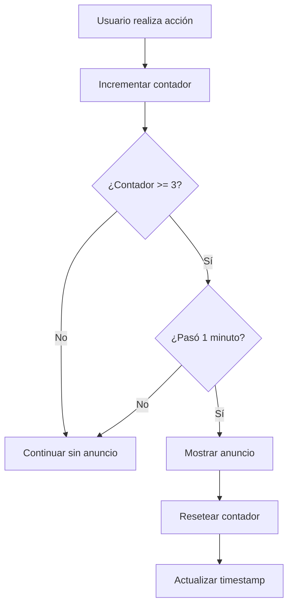

# Google AdMob Integration - AutoCare Pro

## 🎯 Configuración Implementada

### 📱 **Tipos de Anuncios**
- ✅ **Banner Ads** - En pantallas principales
- ✅ **Interstitial Ads** - Después de acciones importantes
- ✅ **Rewarded Ads** - Para funcionalidades premium

### 🔧 **Configuración Técnica**

#### **1. Dependencias Instaladas**
```bash
npm install react-native-google-mobile-ads
```

#### **2. Configuración app.json**
```json
{
  "plugins": [
    [
      "react-native-google-mobile-ads",
      {
        "android_app_id": "ca-app-pub-3940256099942544~3347511713",
        "ios_app_id": "ca-app-pub-3940256099942544~1458002511",
        "user_tracking_usage_description": "Esta aplicación utiliza datos para mostrar anuncios personalizados."
      }
    ]
  ]
}
```

#### **3. Servicios Implementados**

**AdMobService.ts:**
- Inicialización automática
- Gestión de anuncios intersticiales
- Gestión de anuncios recompensados
- Precarga inteligente
- IDs de prueba incluidos

**useAdMob Hook:**
- Contador de acciones
- Estrategia de anuncios inteligente
- Tiempo mínimo entre anuncios
- Estadísticas de anuncios

### 🎯 **Estrategia de Monetización**

#### **Banner Ads (Siempre Visibles)**
- ✅ **Dashboard** - Banner inferior
- ✅ **ExpensesScreen** - Entre gráficas
- 📍 **Posición**: No intrusivos, integrados naturalmente

#### **Interstitial Ads (Estratégicos)**
```javascript
// Mostrar después de:
- ✅ Guardar mantenimiento (cada 3 acciones)
- ✅ Guardar gasto (cada 3 acciones)
- ⏰ Tiempo mínimo: 60 segundos entre anuncios
```

#### **Rewarded Ads (Opcionales)**
- 🚀 **Funciones premium** futuras
- 📊 **Reportes avanzados**
- 🎁 **Remover anuncios temporalmente**

### 📊 **Ubicaciones de Banners**

```
🏠 Dashboard
├── Header con estadísticas
├── Vehículos destacados
├── Acciones rápidas
└── 📺 Banner Ad ← AQUÍ

💰 Expenses Screen  
├── Resumen de gastos
├── 📊 Gráfica de tendencias
├── 📺 Banner Ad ← AQUÍ
├── 📊 Gráfica de categorías
└── Lista de gastos
```

### 🔄 **Flujo de Anuncios Intersticiales**



### 🎛️ **Configuración para Producción**

#### **Paso 1: Crear Cuenta AdMob**
1. Ir a [Google AdMob](https://admob.google.com/)
2. Crear cuenta y aplicación
3. Obtener App ID real

#### **Paso 2: Crear Ad Units**
```javascript
// Reemplazar en AdMobService.ts
const AD_UNIT_IDS = {
  BANNER: 'ca-app-pub-XXXXXXXXXXXXXXXX/XXXXXXXXXX',
  INTERSTITIAL: 'ca-app-pub-XXXXXXXXXXXXXXXX/XXXXXXXXXX', 
  REWARDED: 'ca-app-pub-XXXXXXXXXXXXXXXX/XXXXXXXXXX',
};
```

#### **Paso 3: Actualizar app.json**
```json
{
  "android_app_id": "ca-app-pub-XXXXXXXXXXXXXXXX~XXXXXXXXXX",
  "ios_app_id": "ca-app-pub-XXXXXXXXXXXXXXXX~XXXXXXXXXX"
}
```

### 📈 **Optimizaciones Implementadas**

#### **UX Optimizada**
- ⏰ **Tiempo mínimo** entre intersticiales
- 🎯 **Contador de acciones** para frecuencia
- 🚫 **No anuncios** en acciones críticas
- ✨ **Banners integrados** naturalmente

#### **Performance**
- 🔄 **Precarga automática** de anuncios
- 💾 **Caché inteligente** 
- ⚡ **Inicialización asíncrona**
- 📊 **Métricas de rendimiento**

#### **Error Handling**
- 🛡️ **Fallbacks** si no hay anuncios
- 📝 **Logging detallado**
- 🔄 **Reintentos automáticos**
- ⚠️ **Graceful degradation**

### 🧪 **Testing**

#### **Modo Desarrollo**
- ✅ Usa **Test Ad Unit IDs**
- ✅ **No revenue** generado
- ✅ **Debugging** habilitado

#### **Comandos de Test**
```bash
# Verificar inicialización
console.log('AdMob initialized:', adMobService.initialized);

# Ver estadísticas
const stats = await useAdMob().getAdStats();
console.log('Ad Stats:', stats);
```

### 💰 **Proyección de Revenue**

#### **Estimaciones Conservadoras**
```
Usuarios diarios: 100
Sesiones por usuario: 3
Banner RPM: $0.50
Interstitial RPM: $2.00

Revenue diario estimado: $2-5
Revenue mensual estimado: $60-150
```

### 🚀 **Próximos Pasos**

1. **Publicar en stores** con ads de prueba
2. **Conseguir usuarios** reales
3. **Analizar métricas** de engagement
4. **Configurar AdMob real** 
5. **Optimizar ubicaciones** según datos
6. **Añadir rewarded ads** para premium features

### ⚙️ **Configuración Avanzada**

#### **Mediación (Futuro)**
- Facebook Audience Network
- Unity Ads
- AppLovin MAX

#### **A/B Testing**
- Posición de banners
- Frecuencia de intersticiales  
- Formato de anuncios

### 🎯 **Notas Importantes**

- ⚠️ **NO usar IDs reales** en desarrollo
- 🔒 **Respetar privacidad** del usuario
- 📊 **Monitorear métricas** de abandono
- ⚖️ **Balance UX vs Revenue**

**¡La integración está completa y lista para generar revenue!** 🎉
